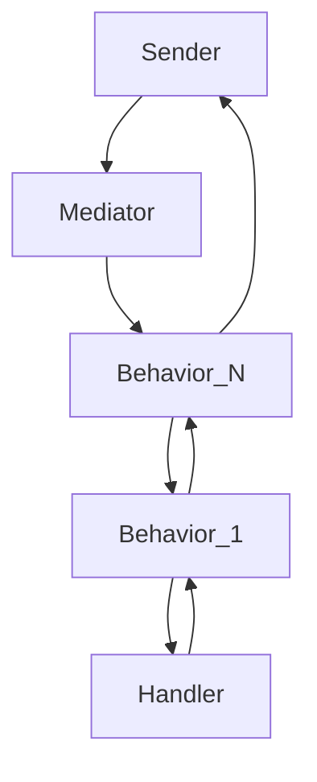

# Architecture Overview

The Mediator library is built on the principle of **Mediated Communication**. Instead of components calling each other directly, they communicate via a central "Mediator" object.

## Core Components

### 1. IRequest<TResponse>
An empty marker interface that defines a request and the type of its expected response.

### 2. IRequestHandler<TRequest, TResponse>
The actual logic that processes a specific request. Decoupled from the sender, it only cares about the input and output.

### 3. IMediator
The dispatcher. It receives an `IRequest<T>`, finds the registered `IRequestHandler`, and executes it.

## The Dispatch Mechanism

To bridge the gap between a generic `SendAsync<T>(IRequest<T>)` call and the strongly-typed handler, the library uses a **Wrapper Pattern**:

1. **Reflection (Initial)**: When a request type is seen for the first time, the Mediator uses reflection to create a generic wrapper (`RequestHandlerWrapperImpl`).
2. **Caching (Phase 1)**: These wrappers are cached in a `ConcurrentDictionary` to avoid the overhead of `Activator.CreateInstance` on every call.
3. **Source Generation (Phase 2)**: The future "Final Boss" optimization will generate the mapping code at compile-time, eliminating the need for reflection and dictionary lookups entirely.

## Pipeline Architecture

The library uses a **Decorator Pattern** to implement pipeline behaviors. When a request is sent:
1. The Mediator resolves all `IPipelineBehaviour<TRequest, TResponse>` from the DI container.
2. It chains them together using an `Aggregate` function.
3. The behaviors execute in a **LIFO (Last-In-First-Out)** order based on their registration in the DI container.

